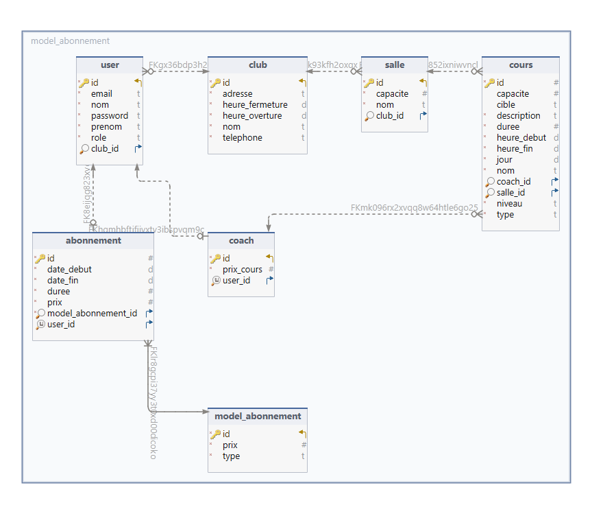

# Instructions to Run SQL Insert Statement

After creating the database and tables, you can insert data into the `model_abonnement` table using the following SQL statement:

```sql
INSERT INTO `model_abonnement` (`id`, `prix`, `type`) VALUES
(1, 75, 'BASIC'),
(2, 110, 'PREMIUM'),
(3, 199, 'VIP');
```

Make sure to execute this statement as it is important and it is directly mapped with pre-defined enums `model_abonnement` table with the initial data.

## Entity Relationship Diagram

Below is the entity relationship diagram for the database. This diagram illustrates the relationships between different tables and their attributes.

